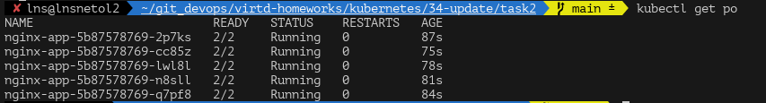
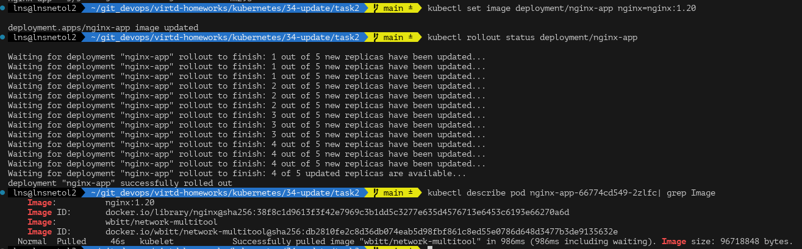
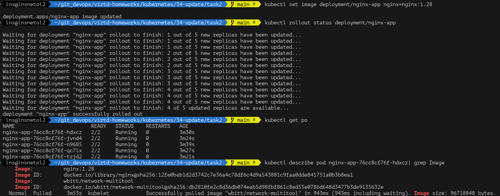
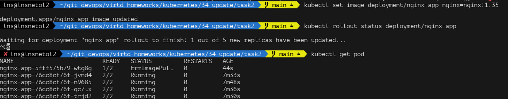
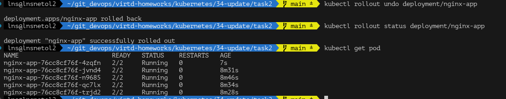

## Задание 1

1. `Recreate` - не подходит

    - Есть момент, когда недоступны обе версии, что по правилам недопустимо.

2. `Blue-Green` - не подходит
    - Требуются ресурсы на вторую порцию реплик (нужно 100%), а у нас запас только 20%.

3. `Canary` - не подходит
    - Одновременно будут работать и старая и новая версии, что по условиям не допустимо.

4. `Rollingupdate` - подходит!
    - Можно ограничить количество одновременно работающих pods
    - Можно не превышать доступные ресурсы
    - Приложение остаётся доступным
    - Поддерживается k8s сразу же

Пример:
```yaml
---
strategy:
  type: RollingUpdate
  rollingUpdate:
    maxUnavailable: 1   # не создаем доп поды
    maxSurge: 0         # теряем макс 1 реплику для постоянной доступности
---
```

## Задание 2

Создадим yaml
```yaml
apiVersion: apps/v1
kind: Deployment
metadata:
  name: nginx-app
spec:
  replicas: 5
  strategy:
    type: RollingUpdate
    rollingUpdate:
      maxSurge: 0
      maxUnavailable: 1
  selector:
    matchLabels:
      app: nginx-app
  template:
    metadata:
      labels:
        app: nginx-app
    spec:
      containers:
        - name: nginx
          image: nginx:1.19
          ports:
            - containerPort: 80
        - name: multitool
          image: wbitt/network-multitool
          ports:
          - containerPort: 8080
          env: 
            - name: HTTP_PORT
              value: "8080"
```

Версия приложения nginx `1.19`

Применим


Теперь обвновим версию с `1.19` до `1.20`


Теперь попытаем обвноиться до `1.28` версии

По идее должно было упасть, но тут же всегда курсы обновляются вовремя)


При обновлении до `1.35` Первый под уходит в ошибку образа. Остальные остаются доступными.


Откатим обновление до `1.28`
