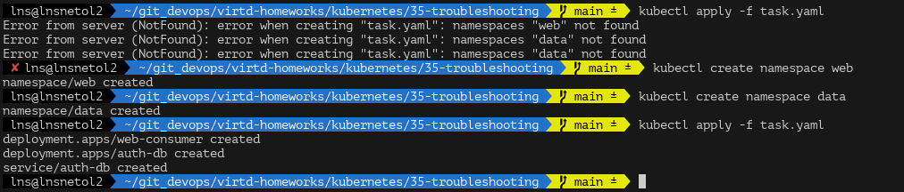
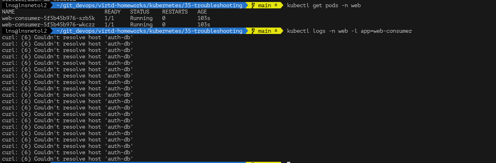
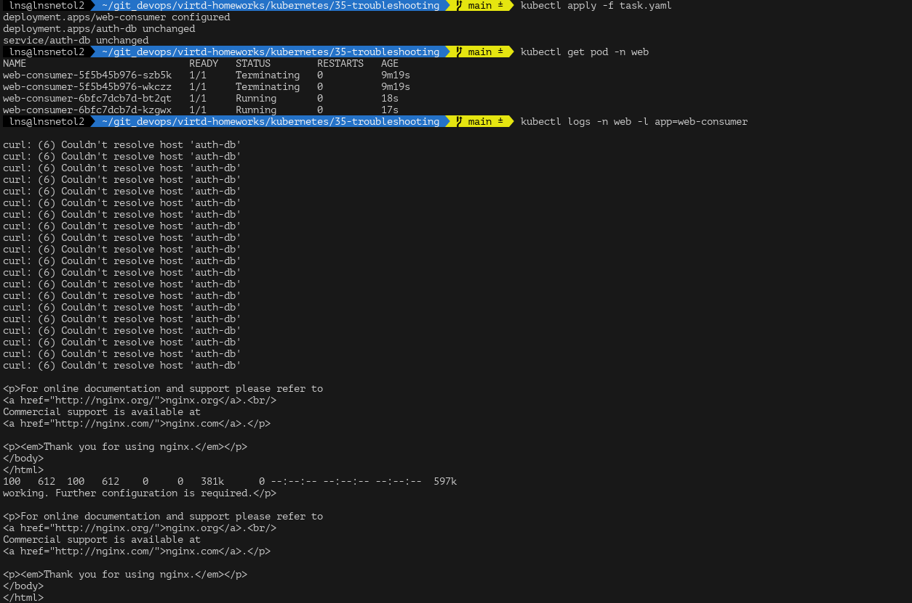
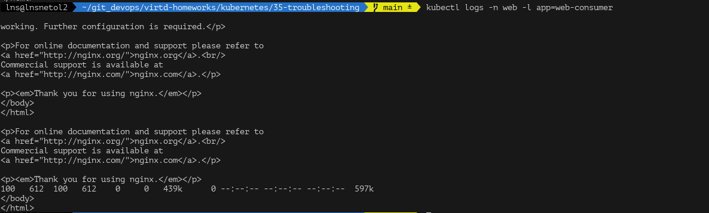

Скопируем yaml и попробум применить



Выдает ошибку о том, что нет указанных в yaml 2х namespace. Создадим их и применим опять

Проверим поды:



web-consumer не может подключиться к БД auth-db

Проблема в неверном dns имени
`curl auth-db` будет работать только при условии, что web-consumer и auth-db в одном namespace, но это не так

* В данный момент имена сервисов `web-consumer.web` и `auth-db.data`

Чтобы curl прошел можем указать верное имя сервиса:
```
curl auth-db.data
```

поменяем в `task.yaml`
```yaml
---
command:
    - sh
    - -c
    - while true; do curl auth-db.data; sleep 5; done
```

И применим заново:





Все работает
